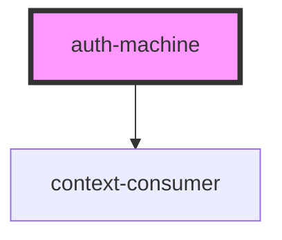

# auth-machine

<!-- Auto Generated Below -->

## Properties

| Property  | Attribute | Description | Type                | Default     |
| --------- | --------- | ----------- | ------------------- | ----------- |
| `event`   | --        |             | `MessageEvent<any>` | `undefined` |
| `request` | `request` |             | `any`               | `undefined` |

## Dependencies

### Depends on

- context-consumer

### Graph

----------------------------------------------

*Built with [StencilJS](https://stenciljs.com/)*
