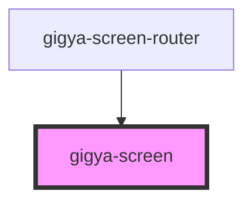

# gigya-screen

<!-- Auto Generated Below -->

## Properties

| Property       | Attribute      | Description | Type     | Default     |
| -------------- | -------------- | ----------- | -------- | ----------- |
| `screen_set`   | `screen_set`   |             | `string` | `undefined` |
| `start_screen` | `start_screen` |             | `string` | `undefined` |

## Dependencies

### Used by

 - [gigya-screen-router](../gigya-screen-router)

### Graph

----------------------------------------------

*Built with [StencilJS](https://stenciljs.com/)*
