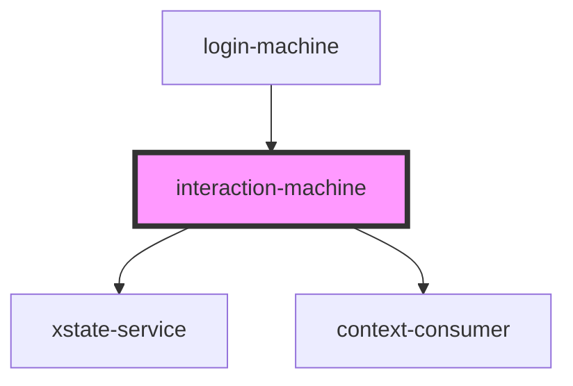

# interaction-machine

<!-- Auto Generated Below -->

## Properties

| Property      | Attribute     | Description | Type                                                                                                                  | Default     |
| ------------- | ------------- | ----------- | --------------------------------------------------------------------------------------------------------------------- | ----------- |
| `interaction` | `interaction` |             | `string`                                                                                                              | `'None'`    |
| `loadService` | --            |             | `(service: ServiceConfig<any, AnyEventObject>) => void`                                                               | `undefined` |
| `service`     | --            |             | `Interpreter<InteractionMachineContext, any, any, any>`                                                               | `undefined` |
| `state`       | --            |             | `State<InteractionMachineContext, InteractionMachineEvent, any, { value: any; context: InteractionMachineContext; }>` | `undefined` |

## Events

| Event     | Description | Type               |
| --------- | ----------- | ------------------ |
| `resolve` |             | `CustomEvent<any>` |

## Dependencies

### Used by

 - [login-machine](../loading-machine)

### Depends on

- [xstate-service](../xstate-service)
- context-consumer

### Graph

----------------------------------------------

*Built with [StencilJS](https://stenciljs.com/)*
