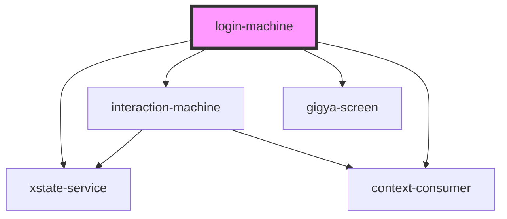

# loading-machine

<!-- Auto Generated Below -->

## Properties

| Property  | Attribute | Description | Type                                                    | Default     |
| --------- | --------- | ----------- | ------------------------------------------------------- | ----------- |
| `login`   | --        |             | `Interpreter<InteractionMachineContext, any, any, any>` | `undefined` |
| `service` | --        |             | `Interpreter<InteractionMachineContext, any, any, any>` | `undefined` |

## Dependencies

### Depends on

- [xstate-service](../xstate-service)
- [interaction-machine](../interaction-machine)
- [gigya-screen](../gigya-screen)
- context-consumer

### Graph

----------------------------------------------

*Built with [StencilJS](https://stenciljs.com/)*
