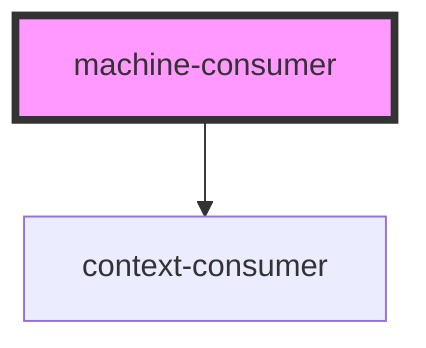

# machine-consumer

<!-- Auto Generated Below -->

## Properties

| Property  | Attribute | Description | Type                              | Default     |
| --------- | --------- | ----------- | --------------------------------- | ----------- |
| `service` | --        |             | `Interpreter<any, any, any, any>` | `undefined` |

## Dependencies

### Depends on

- context-consumer

### Graph

----------------------------------------------

*Built with [StencilJS](https://stenciljs.com/)*
