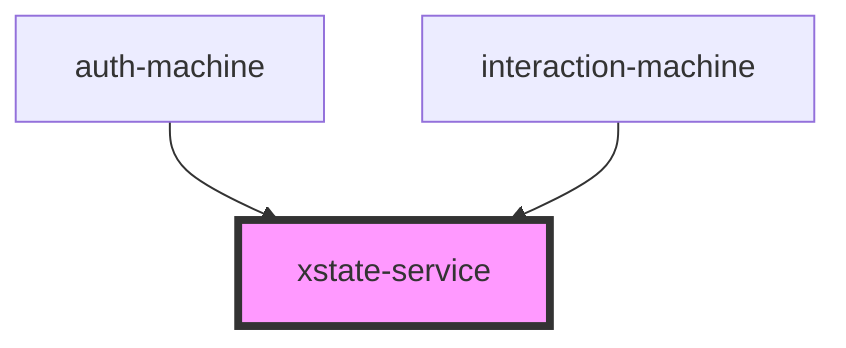

# xstate-service

<!-- Auto Generated Below -->

## Properties

| Property               | Attribute | Description        | Type                                                                                                                                                                                                                                                                                                                                                                                                              | Default     |
| ---------------------- | --------- | ------------------ | ----------------------------------------------------------------------------------------------------------------------------------------------------------------------------------------------------------------------------------------------------------------------------------------------------------------------------------------------------------------------------------------------------------------- | ----------- |
| `callback`             | --        |                    | `<TContext, TSchema, TEvent extends EventObject = EventObject>(arg: { current: State<TContext, EventObject, any, { value: any; context: TContext; }>; send: (event: SingleOrArray<Event<TEvent>> \| Event<TEvent>, payload?: EventData) => State<TContext, TEvent, TSchema, { value: any; context: TContext; }>; service: Interpreter<TContext, TSchema, TEvent, { value: any; context: TContext; }>; }) => void` | `undefined` |
| `renderer`             | --        | Renderer callback  | `(current: State<any, EventObject, any, { value: any; context: any; }>, send: (event: SingleOrArray<Event<EventObject>> \| Event<EventObject>, payload?: EventData) => State<any, EventObject, any, { value: any; context: any; }>, service: Interpreter<any, any, EventObject, { value: any; context: any; }>) => Element \| Element[]`                                                                          | `undefined` |
| `service` _(required)_ | --        | An XState service. | `Interpreter<any, any, EventObject, { value: any; context: any; }>`                                                                                                                                                                                                                                                                                                                                               | `undefined` |

## Events

| Event   | Description | Type                                                                             |
| ------- | ----------- | -------------------------------------------------------------------------------- |
| `ready` |             | `CustomEvent<Interpreter<any, any, EventObject, { value: any; context: any; }>>` |

## Dependencies

### Used by

 - [auth-machine](../auth-machine)
 - [interaction-machine](../interaction-machine)

### Graph

----------------------------------------------

*Built with [StencilJS](https://stenciljs.com/)*
